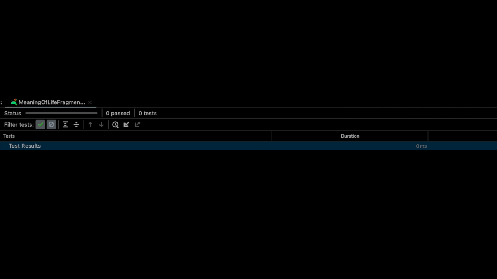
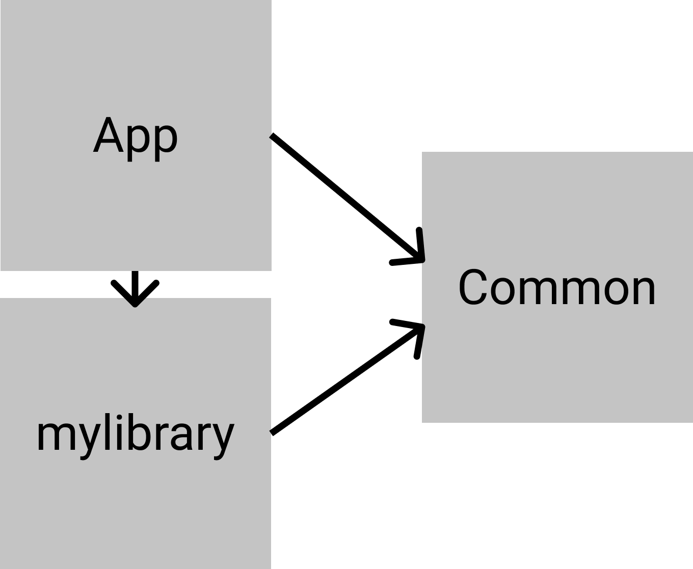

# DexOpener
This is a sample app demonstrating the use of the [DexOpener](https://github.com/tmurakami/dexopener) library in a multi module project.
It is part of [a medium post](https://timrijckaert.medium.com/how-we-made-our-ui-tests-more-stable-with-mockk-and-dexopener-c78b02a86de).



## Architecture


The demo app consists of 3 modules.
- app
- common
- mylibrary

## App

You can check out the `app/build.gradle` and play with the 2 `testInstrumentationRunner` options.

```
testInstrumentationRunner "com.example.dexopener.DexOpeningTestRunner"
testInstrumentationRunner "androidx.test.runner.AndroidJUnitRunner"
```

You'll notice that the default `AndroidJUnitRunner` will not let you have a successful test run on < API 28.
Whereas the `DexOpeningTestRunner` will mitigate this problem.
